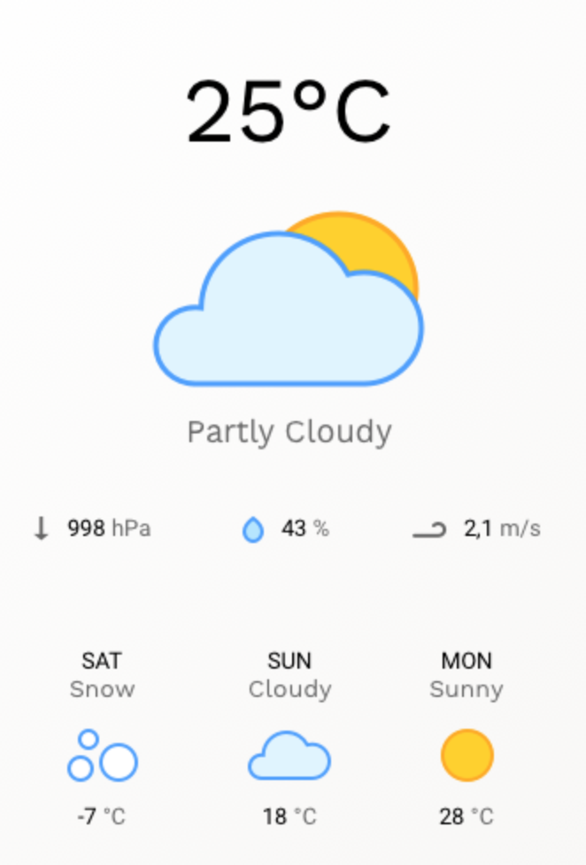

# Warsztat Moduł 4

Celem warsztatu, jest przygotowanie aplikacji pogodowej, sczytującej dane z ogólnodostępnych API. Aplikacja jest częściowo przygotowana. Mamy już dodane podstawowe style, nagłówek, moduł pogodowy (niekompletny), fonty, ikonki. 

Struktura projektu:

```
src
  -- classes (folder z plikami js)
  -- styles (folder z plikami scss)
  app.js (plik główny)

images
  -- icons (ikony dla projektu)

index.html (plik główny aplikacji)
```

Aby zainstalować projekt, wystarczy użyć komendy `npm install`. Następnie w procesie deweloperskim, używamy komendy `npm start` a w produkcyjnym `npm run build` która stworzy nam katalog `build`.

## Założenia
W aplikacji powinniśmy mieć możliwość odnalezienia współrzędnych konkretnego miejsca i na podstawie tych danych, wyświetlić aktualną i prognozowaną pogodę. Chcemy wyświetlać wszystkie niezbędne informacje. W module pogodowym powinna znaleźć się dodatkowo struktura podobna do tej:  



W warsztacie tym należy korzystać z wszystkich udogodnień ES6. W folderze `src/classes` stworzony jest plik `Weather.js`. Posiada on klasę `Weather` której powinniście użyć do pobierania aktualnej pogody na podstawie długości i szerokości geograficznej. Tak samo plik `GeoLocation.js` ma służyć do pobrania tych wartości na podstawie nazwy przesłanej do tej klasy.


## Ikony
W projekcie zainstalowane są ikony Material-Icons. Listę tych ikon możecie znaleźć tutaj: https://material.io/tools/icons.  
Używamy ich za pomocą:

```html
<i class="material-icons">nazwa_ikony</i>
```

## API
**Wszędzie wymagany jest klucz API.**


### Geocoding
API to pozwala nam wyciągnąć informację o szerokości i długości geograficznej na podstawie wpisanego parametru, np. "Wrocław". Dostaniemy wtedy zwrot informacji który widzisz poniżej. 

Należy się zarejestrować, a następnie w zakładce "Api Keys" wygenerować swój klucz i zapisać go w projekcie.

[GraphHopper Directions API with Route Optimization](https://graphhopper.com)  
Pobranie lokalizacji dla konkretnego adresu: https://graphhopper.com/api/1/geocode?q=wroclaw&key=wasz_klucz

Response:
```json
{
    "hits": [
        {
            "osm_id": 2805690,
            "osm_type": "R",
            "extent": [
                16.8073393,
                51.2100604,
                17.1762192,
                51.0426686
            ],
            "country": "Poland",
            "osm_key": "place",
            "osm_value": "city",
            "name": "Wroclaw",
            "state": "Lower Silesian Voivodeship",
            "point": {
                "lng": 17.0326689,
                "lat": 51.1089776
            }
        }
	  ]
}
```

### Darksky
API odpowiedzialne za dostarczenie nam aktualnej i prognozowanej pogody.

Należy się zarejestrować, wygenerować swój klucz i zapisać go w projekcie.

Pobranie klucza: https://darksky.net/dev  
Pobranie prognozy pogody: https://api.darksky.net/forecast/key/latitude,longitude


# Dodatkowe
Dodatkową rzeczą w tym projekcie, może być wykorzystanie API z czasem na świecie. Kolejny moduł mógłby wyświetlać aktualny czas z wybranej strefy czasowej przez użytkownika.

### World Time
[World Time API: Simple JSON/plain-text API to obtain the current time in, and related data about, a timzone.](http://worldtimeapi.org/)
Pobranie wszystkich stref czasowych: http://worldtimeapi.org/api/timezone

Pobranie konkretnego czasu: http://worldtimeapi.org/api/timezone/Europe/Warsaw

Response: 
```json
{
	"week_number":"04",
	"utc_offset":"+01:00",
	"unixtime":"1548436838",
	"timezone":"Europe/Warsaw",
	"dst_until":null,
	"dst_from":null,
	"dst":false,
	"day_of_year":25,
	"day_of_week":5,
	"datetime":"2019-01-25T18:20:38.044017+01:00",
	"abbreviation":"CET"
}
```
